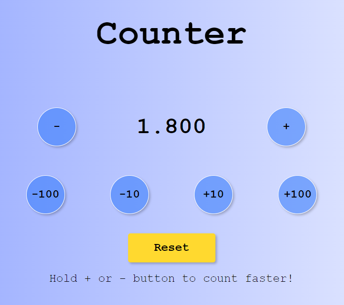

# 
Javascript-Counter

## :blue_book: Description 
A Simple <strong>Javascript counter</strong> where you can increase/decrease the number by one or more units based on the button clicked.
It's also possible to hold the + or - button clicked to add/remove multiple units based on the holding time.
 The <strong>reset button</strong> returns the counter back to 0.

## :point_right: Try It Out

https://chic-hotteok-20bedc.netlify.app/

## :computer: Made With 

- HTML
- CSS
- Javascript Vanilla